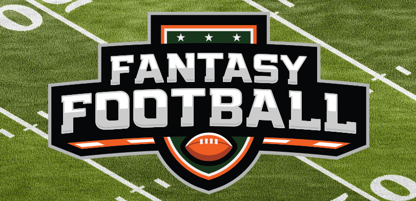

# Cloudy with a Chance of Football

Griffin, Ermina, Yaphet, and Aidan's capstone project for the Certificate of Data Science at the Georgetown University School of Continuing Studies (SCS) (Cohort 23, Spring - Summer 2021).



*Photo courtesy of [Medium](https://bockles.medium.com/how-to-enjoy-fantasy-football-without-being-the-absolute-worst-bcab8b401e17) user Brian Bockleman*

> “Thank you... fantasy football draft, for letting me know that even in my fantasies, I am bad at sports.”   
> 
> *Jimmy Fallon*

## Description

Fantasy football allows fans to act as team managers by drafting, trading for, acquiring, and playing real football players in on fantasy football platforms, scoring points using a scoring system based on real life performance of their players. Fantasy football platforms (such as [ESPN](https://www.espn.com/fantasy/football/) or [Yahoo!](https://football.fantasysports.yahoo.com/)) apply their own analytics to project player performance weekly during the NFL season in preparation for the upcoming week. It is not uncommon for players to score well above or far below their platform-projected fantasy score, leaving fantasy managers wondering which players to draft, trade for, acquire, and play.

We want to know what influences a player's *actual* fantasy score so that we can make data-driven decisions when building a team or weekly starting lineup during the NFL season. To do so, we're using 2019 and 2020 NFL season data and ESPN fantasy football projection data for this project.

## Table of Contents
🐛 Add links to Wiki for each directory
| **Directory**     | **Contents** |
| ----------- | ----------- |
| bin      | Python data ingestion and database setup scripts |
| deliverables   | Georgetown SCS-required documents for project reporting |
| docs   | :bug: Delete this directory and instead discuss in Wiki |
| fixtures   | Raw and cleaned data, images, and database |
| foo   | :bug: Add explanation about foo here |
| notebooks   | Cleaning, Exploratory Data Analysis, Machine Learning Jupyter Notebooks |
| tests   | :bug: Add explanation about tests here |

## Installation
**First**, clone this repository by entering the following into terminal (Mac) or powershell (Windows):

```git clone https://github.com/georgetown-analytics/Cloudy-with-a-Chance-of-Football.git```

**Next**, switch to this directory by entering the following into terminal or powershell:

```cd Cloudy-with-a-Chance-of-Football```

**Finally** ensure you have the proper package versions downloaded by entering the following line into terminal or powershell:

```pip install requirements.txt```

## Usage
🏈 🐛 Add info on how to use this with screenshots or GIFs

## Contributing
At this time, we do not have guidance on how to contribute to this project.

## Credits
Special thanks to Kaggle users [mur418](https://www.kaggle.com/mur418/espn-2019-stats-and-2020-nfl-fantasy-projections) and [tobycrabtree](https://www.kaggle.com/tobycrabtree/nfl-scores-and-betting-data), [Fantasy Data](fantasydata.com), [NFLSavant](http://nflsavant.com/), [Data Pros](https://www.fantasyfootballdatapros.com/), and [NFL Weather](http://www.nflweather.com/) for data use.
